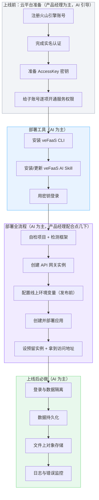

# AI Agent 产品上线部署手册 V1.1

> **阅读分工**：产品经理只读“开局分流”“上线要解决的 5 件事”、第一部分（账号、密钥、权限）、第三部分第八节（创建 API 网关）的“照着点”表和第八部分（上线后验收清单）；其余为 AI 执行内容。产品经理不需要复制附录指令，全程只贴《开始看这里》里的那句话。

## 这份手册有什么用

这是一份给 AI 阅读、产品经理拿来即可用的上线部署手册，是《AI Agent 产品 Vibe Coding 通用技术栈手册》的**续篇**，也是三份手册（通用 → 前端 → 部署）旅程中的**最后一步**（完整旅程见《通用技术栈手册》开头的总地图）。三份手册的分工如下：

| 手册 | 覆盖阶段 | 交付结果 |
| --- | --- | --- |
| 《AI Agent 产品 Vibe Coding 通用技术栈手册》 | 需求验证 → 做出 MVP | 本地可跑、核心链路验证通过 |
| 《AI Agent 产品 Vibe Coding 通用前端技术栈手册》 | MVP 验证成功 → 做出正式前端 | 有前端界面、可交互、移动端可用 |
| **《AI Agent 产品上线部署手册》（本手册）** | 前后端验证通过 → 正式上线 | 公网可访问、有登录、数据不丢、文件不丢、出问题能查 |

本手册默认采用**火山引擎（Volcengine，即"火山云"）+ 函数服务 veFaaS** 作为上线路线。它适用于从零开始、没有公司内部基础设施可依赖的 Agent 产品：不用自建服务器、不用备案域名、不用对接公司 SSO，用云上托管服务即可把 MVP 变成线上产品。

使用这份手册时，产品经理**不需要理解云平台、部署、域名、容器这些概念**。只需要把「产品 PRD、技术栈手册、本手册、已验收的 MVP 代码」一起交给 AI，然后：

> **AI 负责所有技术操作；产品经理只做少量"必须本人才能做"的事（注册账号、实名认证、给子账号开权限、提供密钥、照着 AI 的提示在控制台点几下）。**

这份手册要解决的核心问题是：

> 用一套经过验证的默认上线方案，让一个没有任何开发经验的产品经理，在 MVP 验收通过后，也能顺利把产品推到线上，不需要再临时摸索云平台、权限、部署工具和各类报错。

### 版本说明

- **V1.1**：根据一次真实上线实战，修正了部署顺序（先配环境变量再发布）、把"预留实例"拆成独立一步、补充了真实报错与"判断上线以网址能否打开为准"的原则，并新增"开局分流"和步骤内的术语大白话解释。
- **V1.0**：确立"火山引擎 veFaaS"默认上线路线，覆盖从云账号准备到上线后验收的完整流程。

---

## 分工：产品经理提供什么，AI 做什么

上线环节的分工非常明确，产品经理的负担被压到最低：

```text
已验收的 MVP 代码
+ 产品 PRD（用于确认登录方式、数据留存等少量业务决策）
+ 本上线部署手册（默认方案 + 操作规范 + 固定指令）
→ AI 自检环境与代码
→ AI 给出"上线方案摘要"（用产品语言，不列技术名词；必须含费用量级和预计耗时的当场估算，手册不预设数字）
→ 产品经理确认少量必须决策（登录方式、预算、数据留存）
→ AI 主导部署，产品经理配合完成"必须本人操作"的事项
→ 上线后 AI 给出访问地址、登录方式和验收清单
```

| 事项 | 谁做 | 说明 |
| --- | --- | --- |
| 注册 / 登录云账号 | 产品经理 | AI 无法代替注册 |
| 实名认证（个人/企业） | 产品经理 | 需要本人身份或企业资料 |
| 子账号开通各服务权限 | 产品经理 | 需要账号管理员操作，AI 给"开哪些"清单 |
| 提供 AccessKey（密钥） | 产品经理 | 相当于把"云操作权"交给 AI；上线收尾时 AI 会提醒你删除或降权 |
| 控制台点选（创建网关等） | 产品经理 | AI 给"照着点"的清单，逐屏截图即可 |
| 安装部署工具、调 API、部署、配置、排错 | AI | 全部由 AI 完成 |
| 数据持久化、文件存储、登录隔离、监控 | AI | 全部由 AI 完成 |

**关键原则**：产品经理在控制台的每一次操作，AI 都必须给出"照着点"的清单（点哪个、选哪个、填什么）；产品经理遇到看不懂的界面，直接截图发给 AI，由 AI 判断。不允许让产品经理自行理解云平台概念。

### 强制底线（不可违反）

以下底线与安全、数据、费用直接相关，任何部署过程都不得违反：

1. **密钥不入仓库、不入前端、不在对话和日志中明文回显**。AccessKey、数据库密码、模型 Key 等只放在部署平台的 Secret 或受控配置中。
2. **数据必须可恢复**。上线前必须明确数据持久化方案；不能依赖"进程不重启"来保数据。
3. **文件资产与业务数据分离**。音频、图片等大文件走对象存储，不塞进数据库。
4. **登录与数据隔离**。正式上线必须做到"用户只能看自己的数据"。
5. **错误不泄露堆栈**。线上错误统一结构返回，日志只记必要元信息。
6. **涉及计费的资源，创建前必须让产品经理知情**（费用量级、按量还是包月）。

### 默认方案 vs 备选方案

| 能力 | 默认方案 | 触发备选的条件 |
| --- | --- | --- |
| 跑程序 | 火山引擎函数服务 veFaaS | 已有公司容器平台/服务器时改用 |
| 给网址 | 函数服务 + API 网关（自带 HTTPS 域名） | 已有备案域名时绑定自有域名 |
| 存文件 | 火山引擎对象存储 TOS | 已有公司对象存储时改用 |
| 存数据 | 云数据库 RDS PostgreSQL（需企业实名认证） | 企业认证尚未办下来时，临时用"预留实例 + 定期云备份（SQLite）"过渡，受第十二节的三条上限约束 |
| 登录 | 邀请码登录，会话放 HttpOnly Cookie，邀请码可轮换 | 已有公司 SSO 时对接 |
| 监控 | 结构化日志 + trace_id + Sentry | 已有公司监控平台时接入 |

**注意**：火山引擎的 RDS PostgreSQL **只对企业实名认证用户开放**。本手册的目标是生产级上线，因此默认方案是企业认证 + RDS。企业认证通常需要数天，AI 必须在 PRD 体检或后端开发早期就提醒产品经理并行办理。认证尚未办下来时，可以先用"预留实例常驻 + 定期备份到对象存储 + 启动自动恢复"过渡上线，但它有三条上限：只能单实例、实例重建可能丢失最近几分钟数据、不能扩容。认证办下来后必须切换到 RDS（只需改 `DATABASE_URL`，代码不动）。

---

## 开局分流：先看你属于哪种情况

上线前先花 1 分钟确认"你现在手上有什么"，走不同入口，不用从头走：

| 你的情况 | 怎么判断 | 从哪一步开始 |
| --- | --- | --- |
| **A 全新**：没注册过火山引擎 | 打开 `https://console.volcengine.com` 连登录都进不去 | 从第一部分「一、账号与实名认证」开始 |
| **B 有账号**：注册过、实名过，但没开过函数服务、没建过网关 | 能登录控制台，但从没让程序跑起来过 | 从第一部分「三、子账号权限」开始，重点开权限 |
| **C 老账号**：函数服务、API 网关都开过、建过 | 控制台里能看到旧的网关 / 函数 | 跳到第三部分「九、配置线上环境变量」开始，复用已有网关 |

**产品经理只需回答 AI 一个问题**："你现在能不能登录火山引擎控制台？里面有没有已经开好的函数服务 / API 网关？" AI 会根据回答带你走对应入口。每一步 AI 都给你"照着点"清单，看不懂就截图发 AI。

**同时确认认证类型**：企业认证已完成 → 走默认生产档（云数据库）；只有个人认证 → 先走过渡档上线，同时去办企业认证，办下来后切换。这项记入决策台账 D9。

---

## 上线要解决的 5 件事（产品语言）

上线和"本地能跑"的差距，本质是这 5 件事：

1. **能被访问**——从"自己电脑上的 localhost"变成"任何人都能打开的 https 网址"（手机也能用，因为手机麦克风等能力要求 HTTPS）。
2. **能登录、能隔离**——区分是谁在用，A 看不到 B 的数据。
3. **数据不丢**——业务数据在服务重启、故障后还在。
4. **文件不丢**——音频、图片等大文件有地方存，换设备、清缓存都不丢。
5. **出问题能查**——程序报错能收到通知、能定位到是哪一步出的问题。

这 5 件事，分别对应下面流程图中的云服务和上线后配置。

## 上线流程总览



---

# 第一部分：云平台准备（产品经理为主，AI 引导）

> 本部分的产品经理操作，AI 都必须给出"照着点"的清单；产品经理每做一步，遇到看不懂的界面就截图给 AI。

## 一、账号与实名认证

> **老账号跳过**：如果产品经理已经有账号、也已经开过函数服务 / 网关，跳过本节，直接看第三部分「九、配置线上环境变量」。

1. **注册/登录火山引擎**：访问 `https://console.volcengine.com`。火山引擎和火山云是同一个平台（字节跳动旗下）。

   **登录方式**：可以用**手机号**，也可以用**飞书 / 抖音等字节系账号**直接登录（火山引擎是字节跳动的云，账号体系互通）。选哪个都行，最终进的是同一个控制台。这一步 AI 无法代替，遇到看不懂的登录页就截图问 AI。

2. **实名认证**：默认生产档需要**企业认证**（云数据库 PostgreSQL 只对企业开放），通常需要营业执照等资料并等待数天，建议在后端开发期就并行去办。只有个人认证时，可先走过渡档（预留实例 + 云备份）上线，认证办下来后切换。

## 二、AccessKey（密钥）

AccessKey 是让 AI 代替产品经理操作云资源的凭证，包含两个字符串：

- `AccessKey ID`（一串字母数字，简称 AK）
- `Secret AccessKey`（一串更长的密钥，简称 SK）

生成位置：火山引擎控制台 → 「访问控制 / AccessKey 管理」。生成后把 AK 和 SK 交给 AI。

**注意**：AK/SK 相当于云账号密码，只交给正在使用的 AI 会话；用完可随时在控制台删除/重新生成。

## 三、子账号权限（最容易卡住的一步）

很多账号是**子账号（IAM 用户）**，而不是主账号。子账号默认**几乎没有权限**，需要逐个开通服务权限。判断方法：让 AI 用密钥调用一次身份接口，如果返回 `IdentityType: User`（而不是主账号），就是子账号。

子账号开通权限没有"全选"，必须逐个搜、逐个勾选。上线一个 Agent 产品，通常需要开通以下服务的**完整权限（FullAccess）**：

| 服务 | 搜索关键词 | 作用 |
| --- | --- | --- |
| 函数服务 veFaaS | 函数 / veFaaS | 跑程序 |
| 对象存储 TOS | TOS / 对象存储 | 存文件 |
| 云数据库 RDS | RDS / 数据库 | 存数据（默认生产档必开） |
| 镜像仓库 CR | 镜像 / CR | 用镜像部署时需要 |
| 日志服务 TLS | 日志 / TLS | 查日志排错 |
| 私有网络 VPC | 私有网络 / VPC | 用云数据库时需要 |

操作路径：控制台 → 访问控制 → 用户 → 找到对应子账号 → 权限 → 添加权限 → 逐个搜索上面关键词 → 勾选带 "FullAccess"（完整权限）的策略。

**注意**：不要选 ReadOnly（只读）；权限开完让 AI 重新验证（AI 会调用对应服务接口确认是否生效）。

---

# 第二部分：部署工具（AI 为主）

> 本部分全部由 AI 在本地执行，产品经理无需操作。

## 四、veFaaS CLI

火山引擎函数服务的官方命令行工具，AI 用它完成部署、配置、排错：

```bash
npm i -g @volcengine/vefaas-cli
vefaas --version   # 确认版本 >= 0.2.7
```

## 五、veFaaS AI Skill（重要）

veFaaS 提供了专门教 AI 部署的"技能包"（AI Agent Skill），装了之后 AI 能直接查到官方部署规范，避免瞎猜：

```bash
vefaas skills update
```

这个 Skill 会安装到本机 AI 工具的 skills 目录（例如 `~/.agents/skills/vefaas/`），包含应用部署、函数管理、认证、排错等参考文档。**AI 在开始部署前必须先安装并阅读这个 Skill。**

**注意**：这个目录只对识别 `~/.agents/skills/` 约定的编码工具自动生效。使用其他工具时，AI 要直接用文件读取方式打开该目录下的参考文档，不能假设工具已自动加载。

## 六、登录

```bash
vefaas login --accessKey <AK> --secretKey <SK>
vefaas login --check    # 验证登录
vefaas doctor           # 全面检查环境、凭据、项目、连通性
```

登录成功后，后续所有 `vefaas` 命令都带这个身份执行。

---

# 第三部分：部署全流程（AI 为主，产品经理配合点几下）

> 本部分每一步都标注了"AI 做什么"和"产品经理配合什么"。

## 七、自检项目与检测框架

**AI 做**：

1. 在项目后端目录运行 `vefaas inspect`，检测框架、构建命令、启动命令、端口。
2. 如果检测不到框架（目录结构不是根目录 `main.py` 时，`inspect` 可能显示 `Framework: not detected`、启动命令误判为 `python main.py`），不要猜，显式指定启动命令。

**常见正确启动命令**（FastAPI 项目，代码在 `app/main.py`）：

```bash
python -m uvicorn app.main:app --host 0.0.0.0 --port 8000
```

**为什么用 `python -m uvicorn` 而不是 `uvicorn`**：线上函数实例里 `uvicorn` 命令可能不在 PATH，报 `uvicorn: command not found`；用 `python -m uvicorn` 走模块方式启动，稳定可靠。

**AI 做（打包排除）**：部署前必须确保下面内容**不被打包上传**，否则会泄露密钥、上传几百 MB 无用的虚拟环境：

- `.venv/`、`data/`、`__pycache__/`、`.pytest_cache/`
- `.env`（含真实密钥，绝不能进代码包）
- 部署配置 `.vefaas/`

做法：在后端目录维护 `.gitignore` 和 `.vefaasignore`（veFaaS CLI 打包时用它排除文件）。**部署前 AI 必须确认 `.vefaasignore` 文件名正确、确实生效**（否则 `.env` 密钥会打进包）。

**AI 做（运行时版本）**：veFaaS 默认运行环境是 **native-python3.12**，与通用手册的默认 Python 3.12.x 一致。现有项目若用的是其他版本，部署前必须在 3.12 下跑一遍测试，避免上线才发现语法或依赖不兼容。

## 八、创建 API 网关实例（产品经理配合点几下）

应用需要一个"访问入口"，即 API 网关实例。**没有现成网关时，应用无法部署。**

**AI 做**：先查有没有可用网关：

```bash
vefaas gateway list --first
```

如果返回空，需要创建网关实例。创建有两种方式：

- **方式 A（推荐，产品经理控制台操作）**：AI 给"照着点"清单，产品经理在控制台创建。
- **方式 B（AI 用 OpenAPI 创建）**：需要 APIG 权限，参数较复杂，非必要不用。

**产品经理照着点**：

1. 打开 API 网关控制台（搜索"API 网关"，或 `https://console.volcengine.com/veapig`）。
2. 如提示开通服务，点开通（按量计费）。
3. 点「创建实例」，按下表填：

| 选项 | 选什么 |
| --- | --- |
| 地域 | 与函数服务同地域（默认华北2 北京） |
| 网关类型 | **Serverless 网关**（对接函数服务；不要选标准型，那是给容器/服务器用的，更贵） |
| 实例名称 | 自定义，如 `product-gw` |
| 网络类型 | **公网**（否则外面访问不到） |
| 可观测性三开关（监控告警/日志服务/链路追踪） | 验证阶段**全部关掉**（省钱；程序自身日志够排错） |
| 其他 | 保持默认 |

4. 点确定。创建完成后告诉 AI 网关名称。

**注意**：如果控制台里看到旧的历史失败网关（状态"创建失败"），不用管它，直接创建新的。

## 九、配置线上环境变量（发布前必做）

> ⚠️ **这一步必须在"首次发布"之前做。** 实战经验：不先配 `ENV=prod` 和数据库路径，应用一启动就会崩溃（数据库默认写到只读目录）。

**AI 做**：应用启动依赖的配置（模型 Key、语音凭证、数据库路径等）必须通过**环境变量**（就是程序的"配置开关"：密钥、数据库放哪、要不要强制登录，都不写死在代码里，而是上线时"拨开关"）配到线上，不能用本地 `.env` 文件（`.env` 不打包、不进线上）。

```bash
vefaas env set 'KEY1=VALUE1' 'KEY2=VALUE2' ...
# 或从文件批量导入（导入后删掉本地密钥文件）
vefaas env import --file <文件> --replace
```

**两个"必须先配"的开关（否则程序启动即崩）**：

| 环境变量 | 配什么 | 为什么 |
| --- | --- | --- |
| `ENV=prod` | `prod` | 打开"强制登录"；也是切到线上数据库路径的开关 |
| `DATABASE_URL` | 生产档：RDS PostgreSQL 连接串；过渡档：`sqlite:////tmp/data/app.db`（绝对路径要 4 个斜杠） | veFaaS 实例**除 `/tmp` 外只读**，本地数据库必须放 `/tmp`，否则报 `Read-only file system`；RDS 连接串含密码，只能配在环境变量 |

**其余常见环境变量**：

- **密钥类**：模型 Key、语音凭证等，原样配到环境变量，不要写进代码。
- **文件存储路径**：同理，本地文件目录要指向 `/tmp`（在接对象存储之前）。
- **登录邀请码**：`INVITE_CODES=CODE1,CODE2`（邀请码由 AI 生成后交给产品经理分发，见第十一节；换码只需更新这个变量并重新发布，不改代码）。

配完后让 AI 用 `vefaas env list` 确认键名都在，再进入下一步发布。

## 十、创建并部署应用

**第一步：先部署（首次不带预留实例）**。

> ⚠️ 实战经验：**首次部署不要带 `--minInstance 1`**，否则报 `Function ... not deployed`（函数还没有初始版本，设不了实例数）。预留实例放到第二步单独设。

**AI 做**：在项目后端目录执行部署：

```bash
vefaas deploy \
  --newApp <应用名> \
  --gatewayName <网关名> \
  --command "python -m uvicorn app.main:app --host 0.0.0.0 --port 8000" \
  --port 8000 \
  --yes
```

各参数含义：

| 参数 | 作用 |
| --- | --- |
| `--newApp` | 创建并绑定一个新应用 |
| `--gatewayName` | 使用哪个网关（第八步创建或已有的） |
| `--command` | 启动命令（显式指定，避免框架误判） |
| `--port` | 监听端口（默认 8000，HTTP 服务必须监听 0.0.0.0） |
| `--yes` | 非交互自动确认 |

部署成功后，用 `vefaas domains` 查看访问地址（形如 `https://xxx.apigateway-cn-beijing.volceapi.com/`）。

**第二步：设预留实例（过渡档必做；生产档接 RDS 后可按需保留以减少冷启动）**。

```bash
vefaas fn scale --id <函数ID> --min 1
```

> 函数 ID 在 `.vefaas/config.json` 或 `vefaas config list` 里能看到。预留实例 = 让函数服务**至少常驻一个实例不关机**，保证 `/tmp` 里的数据不因空闲被回收（详见第十二节）。

**判断上线成没成，只看一件事：网址能不能打开。** 控制台里的状态字段可能滞后（比如还显示"失败"，但网址其实已经能访问了），**以"打开网址能看到页面"为准**。

**发布卡在"滚动中"的处理**：如果部署报 `can not release function when function is releasing`（或 `Release is in rolling status`），说明上一次发布还卡在"滚动"状态。处理：**先别反复点部署**，用 `vefaas fn release-record status --id <函数ID>` 看状态，等它自己结束；仍卡住再用 `vefaas api AbortRelease --FunctionId <函数ID>` 中止，然后重新部署。

### 前端（Next.js）应用单独部署

有正式前端时，前后端是**两个独立应用**，分别部署、各自有访问地址。前端通过 `rewrites` 同源代理到后端，避免 CORS。

**部署前改造（AI 在 `frontend/` 目录完成）**：

1. `next.config.ts` 设 `output: "standalone"`，并把"指向哪个后端"做成环境变量（如 `BACKEND_URL`）。
2. 构建命令在 build 后拷贝静态资源：`npm run build && cp -r .next/static .next/standalone/.next/static`。
3. 启动命令用 `node server.js`，端口 3000。

**关键坑：构建时环境变量**——`rewrites` 的目标地址在 build 时固化，所以 `BACKEND_URL` 必须在**执行部署命令时**一并注入（如 `BACKEND_URL=https://后端地址 vefaas deploy ...`），而不是部署后再 `vefaas env set`（那只对运行时生效，改不了已固化的 rewrites）。

**部署命令**（复用同一网关，创建新应用）：

```bash
cd frontend
BACKEND_URL="https://后端访问地址" vefaas deploy \
  --newApp <前端应用名> \
  --gatewayName <网关名> \
  --buildCommand "npm run build && cp -r .next/static .next/standalone/.next/static" \
  --outputPath ".next/standalone" \
  --command "node server.js" \
  --port 3000 \
  --yes
```

部署后用 `vefaas domains` 查看前端访问地址。**前后端地址在过渡期可并存**：前端地址是正式入口，后端旧界面保留作兜底，验证通过后再决定是否让旧地址跳转到前端。

**上线后验证前端**：前端页面能打开、`/api/*` 能代理到后端（登录/取数正常）、HTTPS 下麦克风等能力可用、移动端真机走一遍。


---

# 第四部分：上线后必做（AI 为主）

## 十一、登录与数据隔离

上线后必须做到"用户只能看自己的数据"。默认采用**邀请码登录**：

- 后端提供登录接口，邀请码换取会话；会话放在 Secure、HttpOnly、SameSite 合理配置的 Cookie 中，前端不自行保存 token（与前端手册第 18.2 节一致）。前后端分属两个地址时，由前端的同源代理转发 `/api/*`，Cookie 落在前端地址下。
- 所有数据接口按当前登录用户过滤；访问他人数据返回 403；权限判断在后端，前端隐藏按钮不算权限控制。
- 邀请码**由 AI 生成、交给产品经理分发**；通过环境变量预置（如 `INVITE_CODES=CODE1,CODE2`）。上线完成后 AI 要把邀请码明文交给产品经理，产品经理再分发给使用的人。
- 邀请码必须**可轮换**：更新环境变量并重新发布即可作废旧码；已登录会话按到期时间自然失效。分发记录（谁、何时）写入 `docs/项目状态.md`，码本身不写入仓库。

**AI 做**：部署后验证三条链路——未登录访问被拒、错误邀请码被拒、正确邀请码能登录并访问。


## 十二、数据持久化（关键）

**默认生产档：云数据库 RDS PostgreSQL。**

1. 产品经理完成企业实名认证后，AI 引导在控制台创建 RDS PostgreSQL 实例（与函数服务同地域、放在 VPC 内、选按量或最小规格；创建前告知费用量级并等确认）。
2. 把连接串配到环境变量 `DATABASE_URL`，代码无需改动（数据库访问已通过配置抽象）。
3. 开启 RDS 自带的自动备份。

**过渡档（企业认证尚未办下来时）：预留实例 + 定期云备份。**

veFaaS 函数实例的 `/tmp` 是**临时存储**：实例缩容或重建后数据丢失。过渡做法是：

1. **预留实例常驻**：首次部署成功后执行 `vefaas fn scale --id <函数ID> --min 1`（首次部署命令本身**不带** `--minInstance`，见第十节），保证有一个实例持续运行，`/tmp` 不因空闲被回收。
2. **定期备份到对象存储**：后台任务每隔几分钟把数据库文件上传到对象存储（如 `db_backup/app.db`）。
3. **启动自动恢复**：服务启动时，如果本地数据库不存在而云端有备份，自动下载恢复。

**过渡档的三条上限，AI 必须原样告知产品经理**：

- 只能单实例。实例数一旦超过 1，每个实例各有一份数据库，用户数据会串号。AI 必须把最大实例数也设为 1。
- 实例故障重建时，最近一次备份之后的数据会丢失（通常是几分钟）。
- 不能随用户量扩容。

企业认证办下来后必须切换到 RDS：创建实例、把 `DATABASE_URL` 换成连接串、把 `/tmp` 里的数据迁入、重新发布，然后验证登录和历史数据都在。


## 十三、文件上对象存储

音频、图片等大文件，上线后必须从本地目录迁移到对象存储，否则换设备/实例重建后文件丢失：

1. 创建对象存储桶（TOS 桶）。
2. 代码层通过存储抽象读写对象（本地/S3 兼容协议可切换）。
3. 配置线上环境变量：`STORAGE_PROVIDER=s3`、`S3_ENDPOINT`、`S3_ACCESS_KEY`、`S3_SECRET_KEY`、`S3_BUCKET`、`S3_REGION`。

**TOS 的 S3 兼容参数**：

- 访问地址（endpoint）是 `https://tos-s3-cn-beijing.volces.com`（注意带 `tos-s3-` 前缀）。
- 客户端要显式指定 `signature_version="s3v4"` 和 `addressing_style="virtual"`。
- 桶名要求小写字母、数字、连字符，且全局唯一（可用账号 ID 做后缀）。

## 十四、日志与错误监控

上线后必须有"出问题能查、能收到通知"的能力：

1. **结构化日志 + trace_id**：每个请求生成 trace_id，串联模型调用、语音、检索等各环节，日志只记元信息（session_id、耗时、命中数），不记密钥和敏感原文。
2. **错误监控（Sentry）**：配置 `SENTRY_DSN` 后自动捕获未处理异常，配置通知（邮件/企微），程序出错即告警。

---

# 第五部分：排错清单（常见问题与处理）

每条按「现象 → 原因 → 解决」组织。AI 遇到类似报错时直接对照。

| 现象 | 原因 | 解决 |
| --- | --- | --- |
| 部署后启动报 `uvicorn: command not found` | 函数实例 PATH 里没有 uvicorn 命令 | 启动命令改用 `python -m uvicorn ...` |
| 启动报 `OSError: Read-only file system` | veFaaS 实例除 `/tmp` 外只读，代码写到了只读目录 | 数据库/文件目录改为 `/tmp` 下，如 `sqlite:////tmp/data/app.db` |
| 启动报 `PermissionError: Permission denied: '/opt/data'` | 没配 `ENV=prod` / `DATABASE_URL`，数据库默认写到只读目录 | 先配好 `ENV=prod` 和 `DATABASE_URL=sqlite:////tmp/data/app.db` 再发布（见第九节） |
| 首次部署报 `Function ... not deployed` | 首次部署就带了 `--minInstance 1`，函数还没有初始版本，设不了实例数 | 首次部署**不带** `--minInstance`；部署成功后再 `vefaas fn scale --min 1` 单独设预留实例 |
| 控制台显示"部署失败"，但网址其实能打开 | 状态字段滞后，实际已经能访问 | 以"打开网址能看到页面"为准，不要只看状态字段 |
| 部署报 `Release is in rolling status` / `can not release function when function is releasing` | 上一次失败的发布还卡在滚动状态 | 别反复点部署；先 `vefaas fn release-record status --id <函数ID>` 看状态等它结束，仍卡住再 `vefaas api AbortRelease --FunctionId <函数ID>` 中止后重试 |
| `vefaas inspect` 检测不到框架、启动命令误判 | 项目入口不在根目录，自动检测失败 | 显式 `--command "python -m uvicorn app.main:app ..."` |
| 打包上传了几百 MB | `.venv`、`data` 没被排除 | 用 `.gitignore` / `.vefaasignore` 排除 `.venv`、`data`、`.env`、`.vefaas` |
| 密钥泄露进代码包 | `.env` 被打包 | 确保 `.env` 在排除列表；线上配置走环境变量 |
| 子账号调接口报 `AccessDenied` / `not authorized` | 子账号默认无权限，需逐项开服务权限 | 按第一部分第三节清单逐个开 FullAccess |
| 云数据库 PostgreSQL 提示"只对企业用户开放" | RDS PostgreSQL 需企业实名认证 | 立即去办企业认证（默认生产档必需）；等待期间用"预留实例 + 云备份"过渡档上线，认证通过后切换 |
| TOS 对象存储 `Bad Request` / `InvalidPathAccess` | endpoint 不对，或 addressing style 不对 | endpoint 用 `https://tos-s3-cn-beijing.volces.com`；客户端指定 `s3v4` + `addressing_style="virtual"` |
| 创建 VPC 用 POST 报 `action does not exist` | 部分火山引擎 OpenAPI action 只认 GET（参数在 query） | 改用 GET 方式传参数 |
| `vefaas gateway list --first` 返回空 | 没有可用网关实例 | 让产品经理在控制台创建 Serverless 网关（见第八节） |
| 登录后看不到他人数据 / 数据串号 | 数据接口未按用户隔离 | 所有数据接口按当前登录用户过滤，访问他人数据返回 403 |
| 部署成功后数据隔段时间就丢 | `/tmp` 是临时存储，实例缩容被回收 | 部署后 `vefaas fn scale --min 1` 预留常驻实例 + 定期云备份 + 启动恢复；根本解法是切换 RDS |

---

# 第六部分：术语表（大白话对照）

> 下表是"总词典"。正文里每次**第一次**遇到这些词，也已经用大白话就地解释过了，产品经理不用来回翻。

| 术语 | 大白话 |
| --- | --- |
| 火山引擎 / 火山云 | 字节跳动的云服务平台，同一个东西两个叫法 |
| 函数服务 veFaaS | 把程序放上去就能跑、自动给网址的服务，不用自己买服务器 |
| API 网关 | 程序的"大门"，负责把公网请求转给函数服务，并给一个 https 网址 |
| Serverless 网关 | 只对接函数服务的网关，便宜、简单（"标准型网关"更贵，给容器/服务器用） |
| 对象存储 TOS | 云端硬盘，存音频、图片等大文件 |
| 云数据库 RDS | 云端数据库，存业务数据（个人认证账号用不了 PostgreSQL 版） |
| 私有网络 VPC | 云上的"内部局域网"，云数据库要放在里面 |
| AccessKey（AK/SK） | 云账号的"操作密码"，交给 AI 让它代替你操作云资源 |
| 子账号（IAM 用户） | 主账号下开的子身份，默认没权限，要逐个开 |
| 实名认证 | 用个人/企业身份认证云账号；部分服务（如 RDS PostgreSQL）只对企业开放 |
| CLI | 命令行工具，AI 用它敲命令操作云平台 |
| AI Skill | 教 AI 怎么操作某平台的"技能包"，装到本地后 AI 能查官方规范 |
| 环境变量 | 线上程序的"配置开关"（密钥、路径等），不在代码里写死 |
| 预留实例（Min Instance） | 让函数服务至少常驻一个实例不关机，保证临时数据不因空闲被回收 |
| 对象存储备份 | 定时把数据库文件存到云端硬盘，出问题能恢复 |
| 生产档 / 过渡档 | 生产档 = 企业认证 + 云数据库，可长期用；过渡档 = 个人认证 + 临时存储 + 定时备份，只能单实例、只能临时用 |
| trace_id | 每个请求的"追踪号"，出问题能串起来查是哪一步 |
| 部署 / 发布 | 把代码打包上传到云端并让新版本生效 |
| 滚动发布（rolling） | 新版本逐步替换旧版本的过程；卡住时会报"仍在滚动中" |

---

# 第七部分：AI 执行总流程清单

> AI 拿到项目和本手册后，按下面的清单逐项推进，每完成一项打勾。这份清单把前面各部分串成一条可执行的链，避免遗漏。

## 准备阶段
- [ ] 通读 PRD、技术栈手册、本手册、项目代码和已有文档
- [ ] 自检：确认 MVP 已验收、本地能运行、测试通过
- [ ] 读取 `docs/项目状态.md` 决策台账，确认登录方式、数据留存、预算、认证类型（D5、D6、D9）已定；未定的按 PRD 体检规则用决策卡补问，一次不超过 5 个

## 云平台准备（产品经理操作，AI 给清单）
- [ ] 确认账号状态：主账号还是子账号（用密钥调身份接口确认）
- [ ] 确认实名认证状态：企业认证 → 生产档（RDS）；仅个人认证 → 过渡档上线并提醒并行办企业认证
- [ ] 拿到 AccessKey（AK/SK）
- [ ] 给出子账号开通权限的清单（函数服务/TOS/RDS/镜像/日志/VPC 六项 FullAccess）
- [ ] 验证权限生效（逐服务调接口确认）

## 代码改造（适配线上环境，AI 完成）
- [ ] 数据库路径改到 `/tmp`（或接云数据库），保证可写
- [ ] 文件存储接对象存储（本地/云存储可切换的抽象）
- [ ] 实现登录与数据隔离（邀请码换 HttpOnly Cookie 会话、接口按用户过滤、邀请码可轮换）
- [ ] 实现数据持久化：生产档接 RDS；过渡档做预留实例 + 定期备份 + 启动恢复，并把最大实例数设为 1
- [ ] 加结构化日志 + trace_id + 错误监控
- [ ] 打包排除 `.venv`、`data`、`.env`、`.vefaas`，确认密钥不进包
- [ ] 本地测试通过

## 部署（AI 为主，产品经理配合点几下）
- [ ] 交付上线方案摘要，含费用量级与预计耗时的当场估算；计费资源创建前已获产品经理确认
- [ ] 安装 veFaaS CLI，确认版本 >= 0.2.7
- [ ] 安装/更新 veFaaS AI Skill（`vefaas skills update`）
- [ ] 用密钥登录（`vefaas login`），`vefaas doctor` 自检
- [ ] `vefaas inspect` 检测框架，确定启动命令（FastAPI 用 `python -m uvicorn app.main:app ...`）
- [ ] 确认/创建 API 网关（Serverless 类型；没有就引导产品经理控制台创建）
- [ ] **先配环境变量**（至少 `ENV=prod` + `DATABASE_URL=/tmp`，见第九节）
- [ ] 部署应用（**首次不带 `--minInstance`**，显式 `--command`、`--port`）
- [ ] 设预留实例（`vefaas fn scale --min 1`）
- [ ] 拿到公网访问地址（以"网址能打开"为准）

## 上线后验证（AI 完成）
- [ ] 验证登录链路：未登录拒 / 错码拒 / 对码通
- [ ] 验证数据隔离：A 账号看不到 B 账号数据
- [ ] 验证数据持久化：备份已写入对象存储、重启可恢复
- [ ] 验证文件存储：文件写入对象存储、可正常读取
- [ ] 验证监控：错误能上报、trace_id 能串联
- [ ] 交付证据包（访问地址、登录与核心链路截图、AGENTS.md 阶段闸门是否表），存放 `docs/evidence/阶段4/`

## 收尾
- [ ] 更新 README（访问地址、登录方式、验证方法）
- [ ] 提交代码到版本库
- [ ] 把下面的《上线后验收清单》交给产品经理照做
- [ ] 给产品经理"照着点"清单，删除或降权本次使用的 AccessKey
- [ ] 更新 `docs/项目状态.md`：阶段、访问地址、邀请码分发记录（不含码本身与任何密钥）

---

# 第八部分：上线后验收清单（产品经理照做）

> 产品经理拿到访问地址后，逐项打勾。有任何一项不通过，把现象发给 AI 修复。

- [ ] 打开访问地址（https 开头），页面能正常显示
- [ ] 输入邀请码能登录；输错邀请码被拒并有明确提示
- [ ] 用 A 账号登录，看不到 B 账号的记录和数据
- [ ] 核心链路完整跑通（选任务 → 使用核心功能 → 查看结果）
- [ ] 手机上也能用（https 下麦克风等能力正常）
- [ ] 刷新页面、关掉重开，之前的记录还在
- [ ] 换个设备用同一账号登录，数据一致
- [ ] AI 已提醒我删除 AccessKey，我已在控制台删除或降权

---

# 附录：直接交给 AI 的固定指令

> 本附录是 AI 在上线阶段自行调用的内部指令。产品经理只需贴《开始看这里》里的那句话，不需要复制本附录。

产品经理准备好以下材料后，把下面这段话连同材料一起发给 AI 即可：

```text
请帮我完成这个已验收 MVP 的上线部署。请先完整阅读：
1. 产品 PRD；
2.《AI Agent 产品 Vibe Coding 通用技术栈手册》；
3.《AI Agent 产品上线部署手册》（本手册）；
4. 当前项目代码和已有文档（如有）。

执行要求：
- 先自检环境和代码，确认 MVP 已验收、能本地运行，不先重构再理解；
- 按本手册的分工和流程推进，默认采用火山引擎 veFaaS 路线；
- 先给我一份"上线方案摘要"，用产品语言说明：要开哪些云服务、大概费用量级、预计耗时、需要我配合做哪几步、会得到什么结果；
- 涉及计费的资源，创建前必须让我知情并确认；
- 需要我在控制台操作的，每一步都给我"照着点"的清单（点哪个、选哪个、填什么），我遇到看不懂的界面会截图给你；
- 全程遵守强制底线：密钥不入仓库不入前端不回显、数据可恢复、文件与业务数据分离、登录隔离、错误不泄露堆栈；
- 部署完成后，给我访问地址、登录方式（邀请码）、一份我可照做的验收清单和证据包；最后提醒我删除 AccessKey；
- 完成后更新 README，写清线上访问、登录和验证方法。
```

如果只是**已部署后的迭代更新**（代码改了要重新上线），用更短的指令：

```text
项目已经上线到火山引擎 veFaaS，现在代码有更新。请按《AI Agent 产品上线部署手册》重新部署最新代码，保持原有环境变量、启动命令和访问地址不变。完成后告诉我更新结果和访问地址是否正常。
```
