# AI Agent 产品 Vibe Coding 通用技术栈手册 V2.1

> **阅读分工**：产品经理只读《开始看这里》，以及本手册的第〇节、第二节、《PRD 体检》节和第六节里"产品经理确认三件事"的部分；其余章节为 AI 执行内容。产品经理全程只贴《开始看这里》里的那句话，不需要复制本手册第十三、十四节的指令。

## 〇、三份手册的总地图（AI 先读，再转述给产品经理）

> **定位先说清**：本套手册共三份，是给 **AI 的执行 + 引导剧本**，不是给产品经理的教程。AI 在整个旅程中分阶段读完三份（每个阶段只读 AGENTS.md 第 7 节加载表指定的章节），负责把其中"产品经理操作"的部分，翻译成一步一步的可执行指令（去哪个网站、点哪个、填什么、看什么、确认哪句）。产品经理只需要照着做 + 确认 + 验收，不需要理解任何技术、设计、部署概念。

| 手册 | 用在哪一步 | AI 用它做什么 | 产品经理在这一步做什么 |
|---|---|---|---|
| ① 本手册（通用技术栈） | 拿到 PRD，开始开发 | 输出《技术适配声明》、开发 MVP、跑双层测试 | 提供 PRD / Key / 设计参考；确认声明；按清单验收 |
| ② 前端技术栈手册 | MVP 核心链路验证通过后 | 做正式前端（视觉 / 语音 / 交互 / 响应式） | 确认视觉方向；看代表页反馈；真机验收 |
| ③ 上线部署手册 | 前后端都验证通过后 | 部署到火山引擎 veFaaS、配置、上线验收 | 注册 / 实名 / 开权限 / 给密钥；控制台照着点；上线验收 |

### 完整旅程（产品经理视角，AI 逐段引导，不要一次性倒出）

```text
开始前  PM 使用能执行命令、读写文件的编码 Agent 工具（见《开始看这里》第一节的运行前提；网页聊天窗口不适用）；
        AI 先检查产品经理电脑环境（Python / Node / Git 是否就绪，缺什么 AI 引导装什么）；
        模型 Key 有没有——没有的话 AI 告诉产品经理去哪申请，开发期可先用 mock，验收前补齐
第 0 步  PM：把 PRD 放进 docs/PRD/（没有也行，AI 会访谈问出来），用编码工具打开项目文件夹，贴《开始看这里》那句话
第 0.5 步 AI 做 PRD 体检 → 输出《PRD 补全清单》
         PM 只回答"必须问"的问题（一次不超过 5 个，可回复"按推荐"）
第 1 步  AI 读本手册 → 输出《技术适配声明》+ 决策台账初版
         PM 只确认三件事：理解对不对 / 有没有新增 PRD 没要求的费用·平台·范围 / 暂缓项影不影响本阶段验收
第 2 步  AI 分阶段开发 MVP（核心链路；多轮对话、需人工确认的产品会带一个"临时验收界面"）
         PM 在开发期只做：提供 Key、提供设计稿或参考、按"照着做"清单验收
         （注意：MVP 阶段的"临时验收界面" ≠ 正式前端，它只是给 PM 判断 Agent 质量的工具）
第 3 步  MVP 核心链路验收通过 → AI 读《前端技术栈手册》做正式前端
         PM 确认视觉方向、看代表页给反馈、真机操作
第 4 步  前端验收通过 → AI 读《上线部署手册》引导上线
         PM 注册 / 实名 / 开权限 / 给密钥、控制台照着点
第 5 步  上线后 PM 按验收清单逐项验证，得到公网访问地址
```

> 每一步结束时，AI 都必须给产品经理一个明确的"下一步做什么"的指令；产品经理不知道怎么做时，直接截图或描述现象给 AI。
>
> 产品经理全程只需要把《开始看这里》里的**那句话**贴给 AI。三份手册各自的"固定指令"（通用手册第四部分第十三/十四节、前端手册第 25 节、部署手册附录）是 AI 在对应阶段自行调用的内部指令，产品经理不需要挑选或拼接。
>
> AI 的强制底线、追问规则、阶段闸门和证据包要求，压缩在项目根目录的 `AGENTS.md`（核心规则卡）中，每次会话自动生效；本手册是它的展开说明，两者冲突时以 `AGENTS.md` 为准。

## 这份手册有什么用

这是一份给 AI 阅读、并由 AI 转述给产品经理的通用工程手册，适用于从零开发或继续迭代大多数以 LLM 为核心能力的 AI Agent 产品（智能写作、知识库问答、数据分析 Agent、流程自动化 Agent、多媒体创作 Agent 等）。

它不替代具体产品的 PRD，也不假设所有 Agent 产品必须拥有同一种架构。换一份 Agent 产品 PRD 时，本手册中的**工程底线保持不变**，默认技术方案由 AI 结合 PRD、现有代码和运行环境做一次适配；产品差异由 PRD、技术适配声明和阶段技术开发文档表达。

使用这份手册时，产品经理**不需要自己完成技术选型或编写技术开发文档**。只需要把产品 PRD、本手册和已有代码（如有）一起交给 AI；AI 必须先输出一份非技术人员也能理解的《技术适配声明》，再生成当前阶段技术开发文档并按阶段开发。

这份手册要解决的核心问题是：

> 用稳定的默认技术基线减少无意义的选型，同时允许产品形态真正需要的例外；先验证核心链路和 Agent 效果，再逐步完成正式产品。

### 版本说明

V2.1 相比 V2.0 的核心变化：不再把“通用工程原则”和“默认实现方案”混为一谈；新增“强制底线 / 默认方案 / 按需模块”三层规则；新增开工前《技术适配声明》；允许根据产品交互形态采用后端先行或纵向切片；把数据库、API 前缀、配置载体和 Agent 编排方式从绝对规定调整为带判断条件的默认方案。

---

## 分工：产品经理提供什么，AI 生成什么

开发一个 Agent 产品时，产品经理主要提供两份输入，AI 负责生成两份工程输出：

```text
产品 PRD（做什么 —— 每个产品不同）
+ 本技术栈手册（工程底线 + 默认技术基线 + 适配规则）
+ 当前已有代码和约束（如有）
→ AI 输出《技术适配声明》
→ 产品经理确认没有偏离产品目标
→ AI 生成当前阶段技术开发文档
→ AI 分阶段开发、运行、测试和修复
```

阶段技术开发文档不是要求非技术产品经理预先编写的第三份输入。新项目中由 AI 根据 PRD、手册和技术适配声明生成；已有项目若已经存在，则作为上下文继续维护。

三者的内容边界必须清晰，避免重复和冲突：

| 内容 | 归属 | 说明 |
| --- | --- | --- |
| 用户、业务对象、业务流程、功能清单、交付阶段 | PRD | 用产品语言描述，产品间各不相同 |
| Agent 效果验收标准（采纳率、准确率、质量容忍度） | PRD + 阶段文档 | 手册只规定"必须验证"，不规定数值 |
| 安全、可恢复性、可验证性、错误边界等工程底线 | 本手册 | 强制遵守 |
| 后端语言、框架、数据库、测试工具 | 本手册 + 技术适配声明 | 手册给默认值，AI 根据适配条件确认是否采用 |
| API、配置、目录和持久化实现 | 本手册 + 阶段文档 | 遵守统一原则，具体实现允许按产品适配 |
| 验收方法（双层测试、流式验证手段） | 本手册 | 固定方法，具体用例在阶段文档 |
| 技术状态机、数据结构、API、Prompt、测试和验收清单 | 阶段技术开发文档 | 由 AI 从 PRD 和技术适配声明推导，模板见第三部分 |
| 采用、暂缓和偏离了哪些默认方案 | 技术适配声明 | AI 开工前输出，产品经理只需确认是否符合产品目标 |

**冲突处理**：业务行为以 PRD 为准；安全、隐私、数据保护和验收真实性等强制底线不得被普通 PRD 默默覆盖；默认技术方案可以因 PRD、现有系统、部署环境或成本限制而调整，但必须写入技术适配声明，说明理由、影响和恢复条件。AI 发现无法裁决的业务冲突或会显著改变成本、数据安全、交付终端的冲突时，必须明确指出，不得自行猜测。

除非适配条件被触发，否则直接采用本手册的默认方案，不进行开放式技术选型。适配不是让 AI 罗列十种框架让产品经理选择，而是让 AI 给出一个推荐结论，并用产品语言解释少量关键取舍。

## 本手册的三层规则

手册中的每条技术要求必须归入下面一层。AI 不得把默认方案伪装成不可违反的原则，也不得用“需要灵活”绕过强制底线。

| 层级 | 含义 | 处理方式 | 典型内容 |
| --- | --- | --- | --- |
| A. 强制底线 | 与安全、数据、可恢复性、可验证性直接相关 | 必须遵守；确因法律或公司规范不同而替换时，采用更严格规则 | 密钥不进入前端和仓库、输入输出校验、长任务可恢复、错误不泄露堆栈、真实测试不冒充 |
| B. 默认方案 | 适合大多数从零开始的 Agent MVP | 默认直接采用；触发适配条件时由 AI 给出一个替代方案并说明理由 | Python、FastAPI、Pydantic、pytest、Web 端 Next.js、`/api/v1` |
| C. 按需模块 | 只有特定需求出现时才有价值 | PRD 或现有代码触发后才引入，不为“技术栈完整”预装 | SQLAlchemy、Alembic、Chroma、OCR、任务队列、对象存储、SSE |

判断顺序固定为：

```text
先检查强制底线
→ 再判断默认方案是否适配
→ 最后只引入被需求触发的按需模块
```

### 通用适用边界

本手册默认面向单体或模块化单体架构、MVP 到早期生产阶段、以 API 驱动的 Agent 产品。出现以下情况时仍可使用本手册的工程底线和验收方法，但不能机械套用全部默认技术：

- 必须嵌入已有企业系统、已有代码仓库或既定云平台；
- 纯端侧、离线设备、浏览器扩展、实时音视频或强硬件依赖产品；
- 医疗、金融、政务等有专门法规和审计要求的产品；
- 高并发、多租户、跨地域容灾或严格实时系统；
- 产品的核心能力依赖 UI 内人工确认、空间画布、音视频时间轴等交互闭环。

遇到这些情况，AI 应保留底线、缩小改动面，并在技术适配声明中说明哪些默认项不适用，而不是强行重构产品。

---

# 第一部分：使用说明

## 一、核心原则：核心链路先验证，产品界面按需介入

Agent 产品的开发分成两个部分：

```text
后端：实现数据存储、业务流程、模型调用、Agent、RAG、文件处理等核心能力
前端：把已经验证成功的后端能力，做成用户可以操作的界面
```

默认采用“后端能力先行”：先把模型调用、数据处理、状态流转和 API 做成可独立验证的核心能力，再投入正式前端。这能减少在 Agent 效果尚未成立时过早打磨界面。

但“后端先行”是默认策略，不是所有产品都必须遵守的铁律。当人工确认、可视化编辑、画布操作、音视频时间轴或多轮交互本身就是 Agent 能力的一部分时，应采用**纵向切片**：在一个阶段内同时做最小后端能力和最小真实交互，先跑通一条端到端链路，再扩展下一条。

两种允许的开发路径：

```text
路径 A｜后端先行（默认）
后端能力 → API / 自动化验证 → Agent 效果验证 → 正式前端 → 联调

路径 B｜纵向切片（交互是核心能力时）
一个最小用户任务 → 最小界面 + 最小后端 + 真实模型 → 端到端验证
→ 再逐条扩展任务
```

AI 必须在《技术适配声明》中选择其中一条并说明原因。标准产品生命周期是：

```mermaid
flowchart LR
    subgraph beforeDevelopment["开发前"]
        direction LR
        productPrd["产品 PRD"] --> adaptation["技术适配声明"]
        adaptation --> stageDocs["分阶段技术开发文档"]
    end

    subgraph productDevelopment["开发中"]
        direction LR
        coreBuild["开发最小核心链路"] --> apiCheck["接口 / 交互与业务验证"]
        apiCheck --> agentCheck["Agent 效果验证"]
        agentCheck --> coreReady["核心链路可用"]
        terminalChoice{"扩展正式产品终端"}
        webClient["Web 网页"]
        appClient["手机 App"]
        desktopClient["桌面端"]
        miniClient["小程序"]
        frontendReady["选定终端前端可交互"]
        integration["前后端联调"]
        releaseTest["功能与 Agent 测试"]

        coreReady --> terminalChoice
        terminalChoice --> webClient
        terminalChoice --> appClient
        terminalChoice --> desktopClient
        terminalChoice --> miniClient
        webClient --> frontendReady
        appClient --> frontendReady
        desktopClient --> frontendReady
        miniClient --> frontendReady
        frontendReady --> integration --> releaseTest
    end

    subgraph beforeLaunch["上线前"]
        direction LR
        deployPlan["确认部署与数据方案"] --> infrastructure["服务器、数据库与文件存储"]
        infrastructure --> launchConfig["登录、安全、域名与合规"]
        launchConfig --> deployment["部署上线"]
    end

    subgraph afterLaunch["上线后"]
        direction LR
        monitoring["Agent 效果监控"] --> dataReview["数据分析"]
        dataReview --> feedback["用户反馈"]
        feedback --> iteration["持续迭代"]
    end

    stageDocs --> coreBuild
    releaseTest --> deployPlan
    deployment --> monitoring

    style beforeDevelopment fill:#F2F4F7,stroke:#98A2B3
    style productDevelopment fill:#E8F3FF,stroke:#3DADFF
    style beforeLaunch fill:#F1EBFF,stroke:#874FFF
    style afterLaunch fill:#E8F8EC,stroke:#66D575
    style terminalChoice fill:#FFECBD,stroke:#FFC943
    style coreReady fill:#CDF4D3,stroke:#66D575
    style deployment fill:#CDF4D3,stroke:#66D575
```



这条流程包含三个重要判断：

- 默认情况下，**核心能力没有验证通过，不进入大规模正式前端开发。**
- 如果交互本身决定 Agent 是否可用，应尽早做最小真实界面，不把 UI 错误地当成最后的“展示壳”。
- **前端阶段一次只选择一个主要终端；产品稳定后，再复用同一套后端扩展其他终端。**

### 业务核心尽量不与某个终端绑定

同一套后端可以同时服务不同终端：

```text
                         ┌→ Web 网页
同一套后端和 API 接口 ──┼→ 手机 App
                         ├→ 桌面端
                         └→ 小程序
```

- 默认可以复用的是**同一套后端、持久化能力、业务逻辑和 API**。
- 不同终端调用的是同一套后端能力；页面、交互和适配方式不同，因此前端代码不一定是同一套。
- 如果未来要同时支持多个终端，应先完成一个终端，再逐步扩展。
- 如果某项能力只能在特定终端完成（如端侧模型、摄像头实时处理），应把可复用业务规则与终端专属能力分层，而不是强求全部进入统一后端。

## 二、与 PRD 的配合契约

**不要求产品经理设计数据库或 API；缺失的技术表达由 AI 在技术适配声明和阶段文档中补全。**产品信息的缺口按下一节《PRD 体检》处理：分成"必须问"和"可默认"两类。必须问的一次不超过 5 个并附推荐答案；可默认的由 AI 先填默认值、写明理由，产品经理确认一次。

1. **目标用户与核心任务**——谁在什么场景下，用它完成什么任务？
2. **输入、过程和产物**——用户提供什么，过程中要看见或确认什么，最终得到什么？哪些内容需要长期保留？
3. **Agent 的主链路**——流程是一次生成、分阶段确认、多轮对话，还是可以调用工具动态处理？哪些关键步骤必须由用户确认？
4. **Agent 效果的验收标准**——什么叫"生成得好"？允许什么样的瑕疵（如个别格式笔误）由谁在验收时判断？
5. **交付阶段和优先级**——最小可用版本必须包含什么？哪些可以后做？
6. **模型与成本约束**——有没有指定或禁用某家模型？单次任务或每月成本上限是多少？
7. **数据与非功能要求**——是否涉及个人信息、企业机密或受监管数据？目标用户量、响应时间、文件限制和部署位置是否有硬要求？
8. **上线与账号**——内部试用还是对外？登录方式有无要求？能否办云平台企业认证？每月云费用预算？（本项由决策台账 D5、D9 承接，可后填）

AI 根据这些产品信息推导业务实体、状态机、存储方式、接口形态和测试方法。产品经理不需要回答 ORM、消息队列、API 前缀或目录结构等实现问题。

## 二之一、PRD 体检（技术适配声明之前必做）

> 产品经理请读本节。这是 AI 引导你补全 PRD 的固定流程，也是整个项目里你最需要参与的一步。

PRD 写得不完整是常态。AI 不得直接用默认值填满缺口然后往下跑，也不得一次抛出大量问题。固定流程如下：

1. **对照检查**：AI 拿到 PRD 后，对照第二节的七类信息和《PRD 模板》逐项检查，标出缺失、含糊、互相矛盾的地方。
2. **分类**：每个缺口归入两类之一。
   - **必须问**：会改变目标用户、核心任务、成本、安全、隐私或交付范围的。例如：验收标准完全缺失；没说是否涉及个人信息或企业机密；没说成本上限；主链路是一次生成还是分步确认没说清；上线是内部试用还是对外。
   - **可默认**：其余。AI 先用本手册默认值填上，写明理由，产品经理确认一次即可。例如：文件格式限制、响应时间、是否保留历史记录、API 前缀。
3. **输出《PRD 补全清单》**，格式固定：

```markdown
# PRD 补全清单

## 必须问（本轮不超过 5 个）
### 问题 1：{一句话}
- 为什么重要：
- 选项：A / B / C
- 推荐：{哪个，一句理由}
- 不选的后果：
（可以只回复"按推荐"）

## 可默认（已用默认值填上，请确认）
| 缺口 | 默认值 | 理由 |
| --- | --- | --- |

## 已发现的矛盾（如有）
- 矛盾点 / 推荐裁决
```

4. **循环**：产品经理回答后，AI 更新清单；若还有必须问的，再来一轮，仍不超过 5 个。清单全部关闭后才进入《技术适配声明》。
5. **落账**：所有决定写入 `docs/项目状态.md` 的决策台账（不超过 10 项，模板见 `AGENTS.md` 第 8 节），后续阶段不再重复问。

**Agent 效果标准填不出来时**：这是最常见的缺口。AI 不要逼产品经理写数字，先在台账 D2 记为"待样例打分"，在第一阶段真实冒烟时按第十节的默认评分法用真实样例定标准。

**企业认证提醒**：默认上线路线需要云平台企业实名认证，通常要几天。AI 在体检阶段就要问清"公司能否办企业认证"（台账 D9），能办的建议现在就去办，与后端开发并行。

## 三、默认后端技术基线与按需模块

对于从零开始、没有既有系统约束的 Agent MVP，默认直接采用下面的基础组合，不做开放式选型：

| 层 | 默认方案 | 规则层级 | 简单理解 |
| --- | --- | --- | --- |
| 后端语言 | Python 3.12.x（与线上运行时一致） | B 默认方案 | 编写业务、Agent 和 AI 能力 |
| 后端框架 | FastAPI | B 默认方案 | 把能力做成可测试和调用的 API |
| 数据校验 | Pydantic | B 默认方案 | 校验接口和模型结构化输出 |
| 后端测试 | pytest | B 默认方案 | 自动检查业务逻辑和错误路径 |
| 代码管理 | Git | A 强制底线 | 保存变更，便于恢复、审查和协作 |
| 模型调用 | 官方 SDK 或经过验证的兼容接口 | B 默认方案 | 调用 LLM、Embedding、图像、音视频模型 |

下面的能力全部按需启用：

| 需求触发条件 | 默认模块 | 不应引入的情况 |
| --- | --- | --- |
| 多实体关系、筛选统计、事务、用户账户、并发修改 | SQLite + SQLAlchemy + Alembic；生产阶段优先评估 PostgreSQL | 单用户、本地、资产文件为主且只有简单索引时，可先用带 schema 版本的文件清单 |
| 文档语义检索、知识库问答 | Chroma 持久化模式 | 没有 RAG，或小规模全文可直接搜索时 |
| 读取或生成 Word | python-docx | 没有 `.docx` 需求时 |
| 解析可复制文字的 PDF | pypdf | 没有 PDF 需求时 |
| 扫描件和图片文字识别 | OCR 方案由阶段文档选定 | 只处理文本 PDF 时 |
| 长耗时任务和并发执行 | 持久化任务记录；达到规模阈值后引入任务队列 | 短请求、单进程即可可靠完成时 |
| 大图片、音频、视频和生成文件 | 本地文件目录；生产阶段评估对象存储 | 不把大二进制默认塞进关系数据库 |
| 需要逐步展示模型内容 | SSE | 只需后台执行和查看最终结果时可用“提交 + 查询状态” |

产品不需要某项能力时，不得为了“技术栈完整”强行使用。模型选型也不由本手册固定，由 PRD 或第一阶段技术开发文档明确厂商、模型名、成本和合规要求。

对于已有项目，默认延续其合理架构。只有现状触犯强制底线、无法满足 PRD，或继续维护的风险明显高于迁移风险时，才提出局部迁移；不得为了让目录和本手册长得一样而整体重构。

## 四、前端终端与介入时机

前端不属于固定后端技术栈。根据最终上线终端选择：

| 上线终端 | 默认前端选择 | 说明 |
| --- | --- | --- |
| Web 网页 | Next.js + TypeScript + Tailwind CSS | 默认优先，用于做正式前端（MVP 阶段的临时验收界面见第五节） |
| 桌面端 | 在 Web 版本基础上评估 Tauri 或 Electron | 可复用后端接口和部分 Web 页面能力 |
| 手机 App | React Native | 需要重新适配手机交互和系统能力 |
| 小程序 | 小程序原生框架或明确指定的跨端框架 | 需要适配平台登录、上传和审核规则 |

如果 PRD 没有明确指定终端，默认先开发 Web 版 MVP。技术适配声明还必须判断前端介入时机：

- 表单提交、后台生成、下载结果类产品：默认后端先行；
- 多轮对话、人工确认、可视化编辑类产品：默认做最小纵向切片；
- 桌面、手机、小程序能力决定产品可行性时：第一阶段就验证对应终端的关键系统能力。

## 五、正确的 Vibe Coding 流程

```text
AI 阅读 PRD、技术栈手册、已有代码和已有阶段文档（如有）
→ AI 检查已有代码与环境
→ AI 输出《技术适配声明》并说明本阶段准备做什么
→ AI 生成或更新当前阶段技术开发文档
→ AI 只开发当前阶段
→ AI 启动项目并运行测试（含真实模型冒烟，见第十节）
→ 产品经理按验收清单亲自操作
→ 发现问题后，把现象和报错交给 AI 修复
→ 再次测试和验收
→ 验收通过后进入下一阶段
```

这是一个"开发—运行—测试—修复—验收"的循环，不是把文档交给 AI 后等待一次性生成成品。

### 产品经理在开发阶段的分步操作（AI 逐条转述，不要一次性倒出）

AI 应在对应时点，把下面每一步翻译成一句可执行指令发给产品经理：

1. **第一步**：把「PRD + 本手册 + 已有代码（如有）」一起发给我。
2. **第二步**：我读完会给你一份《技术适配声明》，你只需确认三点——我理解的产品对不对、有没有新增你 PRD 没要求的费用/平台/范围、被暂缓的能力会不会影响你本阶段验收。确认后我继续。
3. **第三步（需要时）**：把模型 API Key 填到项目配置（我会告诉你位置和格式，填完告诉我）；没有 Key 我先用 mock 推进，验收前你补上即可。
4. **第四步（需要时）**：把设计稿 / 参考产品 / 视觉要求发给我；没有的话我先做一版代表页给你看。
5. **第五步**：我每完成一个阶段，会给你一份"照着点/照着做"的验收清单，你逐项操作，把不符合的地方截图或描述给我。
6. **循环**：重复第 3–5 步，直到本阶段验收通过，再进入下一阶段。

### 用于验收的最小界面

默认不在核心能力尚未成立时投入大量正式视觉开发。但当 Agent 的产出是长文档、复杂结构化内容、多轮对话、图片视频或需要人工确认的阶段结果时，仅靠 Swagger UI 中的 JSON 和自动化测试无法有效判断质量。此时必须提供最小可视化验收界面：

- 能提交输入、查看生成过程（含流式输出）、在线预览或下载最终产出；
- 只实现判断核心价值所必需的交互，不提前铺开完整信息架构和视觉系统；
- 如果交互只是临时查看工具，可以不复用；如果交互本身属于产品核心，应作为正式前端的第一条纵向切片，避免重复开发。

**新建后端且只需一次性验收工具时的默认实现**：单个 HTML 文件放在后端 `static/` 目录，由 FastAPI 直接挂载，原生 JS + `fetch` 读取接口或 SSE，避免引入前端脚手架。

如果项目已经有前端，优先在现有前端中增加最小验收入口，不再平行创建一套临时页面。如果 UI 是 Agent 工作流的一部分，则直接使用选定的正式前端技术做最小切片。

是否需要最小验收界面，由技术适配声明先判断，再在当前阶段技术开发文档中明确。判断标准是：Agent 产出或交互是否需要“用眼睛看、亲手操作”才能判断质量。纯数值或状态类产出的产品可以不要。

在扩大下一阶段开发范围前，必须按照产品 PRD 和当前阶段技术开发文档完成当前核心链路验证。不同产品的通过标准不同，因此本手册不规定具体准确率、响应时间或成本数值。

## 六、技术适配声明与开工前自检

每个项目第一次动手前，以及 PRD、交付终端或既有架构发生显著变化时，AI 必须先检查环境和代码，再输出《技术适配声明》。如果全部采用默认项，无需产品经理逐项审批，可报告后继续；如果偏离会显著改变成本、安全、数据迁移、交付终端或已有功能，必须等待确认。

### 《技术适配声明》固定格式

```markdown
# 技术适配声明

## 1. 产品形态判断
- 产品类型与核心任务：
- 核心交互：一次生成 / 多轮对话 / 分阶段确认 / 动态工具调用 / 其他
- 开发路径：后端先行 / 纵向切片
- 当前阶段范围：

## 2. 采用的默认方案
- 方案：采用原因（每项一句话）

## 3. 触发的按需模块
- 模块：由哪条需求触发；当前阶段是否引入

## 4. 偏离或暂缓的默认方案
- 默认方案：替代方案；原因；影响；未来在什么条件下重新评估

## 5. 强制底线检查
- 密钥与隐私：通过 / 待处理
- 数据与任务可恢复：通过 / 待处理
- 输入输出校验：通过 / 待处理
- 错误与日志边界：通过 / 待处理
- 测试与真实模型验收：计划是什么

## 6. 需要产品经理决定的问题
- 直接引用 `docs/项目状态.md` 决策台账中状态为"待定"的条目，用决策卡格式（问题 / 选项 / 推荐 / 不选的后果）列出，不超过 5 个；PRD 体检中已定的不再重复问；没有则写"无"
```

产品经理审阅这份声明时，不需要判断技术名词是否先进，只需要确认三件事：

1. AI 对目标用户、核心任务和交付阶段的理解是否正确；
2. 是否新增了 PRD 没要求的费用、外部平台、数据上传或上线范围；
3. 被暂缓的能力是否会影响当前阶段验收。

如果三项都没有问题，并且“需要产品经理决定的问题”为“无”，AI 可以继续开发。

一个“分阶段确认的多媒体创作 Agent”可能得到如下适配结论：采用 Python、FastAPI 和 Web 默认栈；因为人工确认、图片预览和任务恢复属于核心体验，选择纵向切片；因为 MVP 是单用户且资产以图片视频文件为主，暂缓关系型数据库，先使用带 schema 版本和原子写入的任务清单；当出现多用户、复杂筛选或并发修改时再迁移数据库。这个结论不是要求产品经理选择数据库，而是让 AI 的取舍可见、可追溯。

### 环境与现有代码自检

AI 必须如实报告：

1. **现有项目**：检查 README、项目规则、目录、启动方式、依赖、测试、未提交修改和已有数据；不得先重构再理解。
2. **运行环境**：确认项目所需解释器的真实版本和路径。新建默认 Python 项目用 Python 3.12.x 创建 `.venv`（与上线运行时 veFaaS native-python3.12 一致）；现有项目优先遵循已有版本约束，不擅自升级，但部署前必须在 3.12 下跑通测试。
3. **Git**：确认可用。新项目初始化仓库并配置 `.gitignore`；已有项目不得重复初始化，不覆盖用户未提交修改。
4. **模型 API Key**：**没有 Key 不阻塞开发，只阻塞最终验收。** 开发期用占位值 + mock 测试推进；进入验收前由用户提供真实 Key。
5. **密钥写入方式**：本地开发默认由用户在 `.env` 或产品提供的安全设置入口中填写；生产环境使用部署平台的 Secret 管理。AI 不得在对话、命令输出、日志、截图或提交记录中回显密钥。
6. **端口和外部依赖**：检查端口占用、数据库、文件工具、浏览器或系统能力是否可用；冲突时使用不破坏其他项目的替代端口并记录。

开始开发前需要明确四个问题（答案都应在阶段技术开发文档中）：

1. 当前阶段要做出什么结果？
2. 怎么启动和操作当前项目？
3. 怎么判断当前阶段是否验收通过？
4. 出错时，应该把什么报错和现象交给 AI 排查？

技术栈的作用不是让 AI 一次生成整个产品，也不是让所有项目长成同一副样子；它负责固定工程底线、提供默认路径，并让必要的例外变得透明。

---

# 第二部分：AI 执行规范

> 以下内容主要用于约束 AI 开发。产品经理不需要在开始前记住全部技术细节。

## 七、统一环境和依赖

### 后端环境

| 项目 | 默认选择 | 层级 |
| --- | --- | --- |
| Python | 3.12.x（与线上运行时一致） | B 默认方案 |
| 后端框架 | FastAPI | B 默认方案 |
| 数据校验 | Pydantic | B 默认方案 |
| 测试 | pytest | B 默认方案 |
| ORM | SQLAlchemy | C 按需模块 |
| 数据库迁移 | Alembic | C 按需模块；使用关系型数据库时默认配套 |

### Web 前端环境（仅在选择 Web 端后使用）

| 项目 | 默认选择 | 层级 |
| --- | --- | --- |
| Node.js | 22 LTS | B 默认方案 |
| 包管理器 | npm | B 默认方案 |
| 前端框架 | Next.js + TypeScript + App Router | B 默认方案 |
| 样式 | Tailwind CSS | B 默认方案 |
| 代码检查 | ESLint + TypeScript | A 强制底线（工具可被现有项目等价替换） |

### 版本管理规则

- 新建默认项目使用 `requirements.txt` 或 `pyproject.toml + 锁文件` 中的一种，并记录可复现版本；已有项目延续其依赖管理方式。
- 前端依赖写入 `package.json` 并提交与所选包管理器匹配的锁文件。
- 同一子项目不得无理由混用 npm、pnpm 和 yarn；已有 monorepo 规范优先。
- 不得在无迁移理由和回归验证的情况下升级核心依赖大版本。
- 增加辅助库时说明用途，并把版本约束和验证结果写入项目依赖与交接文档。
- 手册中的具体版本是经过验证的默认基线，不是永久锁死；当版本失去维护、安全支持或与运行环境不兼容时，由 AI 提出单一升级方案并验证迁移。

## 八、默认项目结构

下面是新建“后端先行”项目的默认结构。采用纵向切片时可以同时创建最小 `frontend/`；不需要数据库或调试页时，不创建对应空目录。

```text
project/
├── backend/
│   ├── app/
│   │   ├── api/          # API 路由
│   │   ├── core/         # 配置、安全、日志
│   │   ├── models/       # 数据库模型（使用数据库时）
│   │   ├── schemas/      # 输入输出结构
│   │   ├── services/     # 业务逻辑、AI、Agent、RAG
│   │   │   └── prompts/  # Prompt 模板独立文件
│   │   ├── static/       # 一次性最小验收界面（如阶段文档要求）
│   │   └── main.py       # FastAPI 入口
│   ├── tests/
│   ├── alembic/          # 使用关系型数据库时
│   └── requirements.txt  # 或 pyproject.toml + 锁文件，二选一
├── frontend/             # 选择 Web 终端或采用纵向切片时
├── data/                 # 本地数据库、任务清单、上传文件和向量数据（按需）
├── docs/
│   ├── PRD/              # 产品经理放的 PRD（项目模板已带）
│   ├── 手册/             # 三份手册（项目模板已带）
│   ├── evidence/         # 每阶段证据包（AI 创建）
│   ├── 项目状态.md       # 进度与决策台账（AI 创建维护）
│   └── 阶段文档/         # 技术适配声明、分阶段技术开发文档（AI 创建）
├── AGENTS.md             # 核心规则卡（项目模板已带）
├── CLAUDE.md             # 引用 AGENTS.md（项目模板已带）
├── .env.example
├── .gitignore            # 项目模板已带
└── README.md
```

`docs/` 下的 PRD、手册、规则卡和 `.gitignore` 随项目模板一起交付，产品经理只需放入 PRD。阶段文档、技术适配声明、项目状态、证据包由 AI 在开发过程中创建，保证 AI 在项目目录内就能拿到全部决策上下文。

现有项目已有合理结构时，应延续现有结构，不得无故整体重构。

## 九、工程底线与默认实现规则

本节用 `[A]`、`[B]`、`[C]` 标记规则层级；未单独标记的解释段落继承它所说明的上一条规则。

### 1. 后端与 API

- `[B]` 可复用业务能力默认在后端实现，并能通过 API 或等价的自动化入口独立验证；终端专属能力可以留在对应客户端，但业务规则不得复制多份。
- `[B]` 新建公开 API 默认以 `/api/v1` 开头。内部 MVP 可以先用 `/api`，但必须集中定义；已有项目保留现有前缀。对外发布或发生不兼容变化时必须建立版本策略，不能为形式统一批量改坏已有客户端。
- `[A]` 每个 API 都要定义请求结构、响应结构和错误情况；内部调试接口也不能返回无约束数据。
- `[A]` 前端只通过受控 API 使用后端能力，不直接读取数据库或秘密存储。
- `[A]` 长时间任务必须保存可恢复的任务状态，不能只依赖内存变量，也不能让一次 HTTP 请求无限等待。
- `[C]` 生成耗时较长的 AI 能力应提供 SSE 或“提交任务 + 轮询状态 + 获取结果”的异步接口，具体采用哪一种由技术开发文档明确；该能力必须能脱离正式前端独立验证。
- `[A]` 错误响应格式保持统一，不把程序报错堆栈直接展示给用户。

**使用 SSE 时的默认事件约定**：

- 事件序列：`chunk` 事件零到多次 → 以 `done` 事件（含完整结果）或 `error` 事件结束，二者必居其一。
- **流中途失败必须以 `error` 事件返回与普通响应相同的统一错误结构**（`{"error": {"code", "message"}}`），不允许静默断流，不允许把异常堆栈写进流。
- 易踩的坑：模型 SDK 在**构造客户端阶段**就可能抛错（如无 Key），这类错误发生在重试逻辑之外。必须在调用链最外层做统一兜底，保证任何阶段的失败都走 `error` 事件。

### 2. 数据与状态

- `[A]` 重要业务数据和长任务状态必须持久化并可在进程重启后恢复，不能只保存在内存变量中。持久化载体可以是数据库、带 schema 版本的结构化文件、对象存储或现有平台服务，由数据关系、并发和查询需求决定。
- `[C]` 多实体关系、事务、复杂查询或并发修改触发关系型数据库；选择该模块时，默认通过 SQLAlchemy 定义模型并用 Alembic 管理变更。
- `[A]` 使用结构化文件持久化时，必须定义 schema 版本、原子写入、损坏处理、并发边界和未来迁移路径。
- `[B]` 图片、音频、视频和大型文档默认保存到文件或对象存储，元数据和关联关系保存到选定的结构化存储中。
- `[A]` 状态使用明确枚举或受控值，并遵守阶段文档中的状态流转规则。先定义当前阶段可确认的状态；新增状态要考虑旧数据兼容，不为了“永不改枚举”提前猜完所有未来需求。
- `[A]` 删除重要数据前必须确认；正式生产环境优先使用软删除或审计记录。

### 3. AI 与 Agent

- `[B]` 模型、Agent 和 RAG 调用集中放在清晰的服务或领域层，不散落在 API 路由和页面组件中；目录名称可以延续现有项目。
- `[A]` Prompt 独立管理并可版本追踪，不把大段 Prompt 混在接口代码中。
- `[A]` 模型名称、base_url、超时和参数通过配置读取，代码不硬编码。
- `[A]` 模型调用必须处理超时、失败和有限次数重试（含 SDK 初始化失败，见第九节第 1 条）。
- `[A]` 模型输出必须经过结构校验，不能假设模型总会返回正确格式。结构化产出优先用“模型输出标准格式 + 后端确定性解析 + Pydantic 强校验”，校验失败走有限重试，仍失败走统一错误。
  - **格式约束三件套**：模型“不按格式输出”是常态（如要求 `#` 标题却给 `1.1` 编号、要求 3-5 条却给十几条），只靠重试往往烧钱且不解决。应同时做到：
    1. **Prompt 写正反例**：格式指令给正面示例，并明确“禁止”的反例（如“用 `#` 开头，禁止 `1.1` 编号”），不能只写抽象描述。
    2. **解析器要宽容**：确定性解析同时兼容多种常见等价格式（`#` 标题、中文序号、点分编号），而不是只认一种、靠重试硬扛。
    3. **数量/内容约束不遵守 ≠ 解析错误**：像“每章 3-5 个子标题”这类约束，模型常超量但内容正确，应记为质量瑕疵交产品经理判断，而不是反复重试烧钱。
- `[A]` 记录模型、耗时、Token 用量和错误类型，但不得记录密钥和敏感原文。
- `[A]` **高风险、不可逆、涉及外部发送或费用的动作必须由确定性代码和权限策略约束。**
- `[B]` 固定业务流程默认由代码状态机编排。
- `[C]` 只有产品确实需要动态选工具或规划步骤时，才允许模型在明确的工具白名单、参数校验、预算、最大步数、超时和人工确认点内决策。不得允许无限自主执行。
- `[A]` 关键人工确认点必须持久化，刷新页面、服务重启或更换终端后仍能继续。

### 4. 配置与安全

- `[A]` API Key、数据库密码等敏感信息只能保存在后端可访问、不会提交到仓库的秘密载体中。本地默认 `.env`，也可使用操作系统钥匙串、部署平台 Secret 或产品的后端安全设置；普通配置可以使用 YAML、JSON 或数据库。
- `[A]` 使用 `.env` 时必须加入 `.gitignore`，只提交不含真实密钥的 `.env.example`。使用其他秘密载体时，也要提供不含秘密的配置说明。
- `[A]` 模型 API Key 只能由后端读取，不能进入前端代码或构建产物。
- `[A]` 如果产品允许用户在前端录入 Key，前端只能将其提交给受保护的后端接口；响应必须脱敏，日志不得记录，请求传输和存储必须满足产品安全等级。
- `[A]` 上传文件必须检查格式、真实内容类型、大小和安全文件名，防止路径遍历；高风险场景还需病毒扫描和内容隔离。
- `[A]` 日志不得记录密码、API Key 或完整用户文档。

### 5. 文件处理边界

- `[B]` Word 默认只支持 `.docx`，不支持旧版 `.doc`。
- `[B]` PDF 默认只支持可以选择、复制文字的文件。
- `[C]` 纯图片扫描版 PDF 只有在需求明确要求时才引入 OCR。
- `[A]` 本地文件必须通过选定的结构化存储记录文件名、受控路径、状态、上传时间和业务归属，不得只依赖散落目录猜测资产关系。

## 十、双层验收体系

涉及模型调用的 Agent 核心链路采用双层验证，**两层都必须做，缺一不可**。不涉及模型的纯工程阶段可以不重复调用真实模型，但仍要运行相关自动化与集成测试，并在阶段文档中说明：

### 第一层：mock 自动化测试（每次开发完成必跑）

- 默认用 pytest 编写后端测试；模型调用一律 mock，离线可跑。前端和其他终端使用其技术栈对应的测试工具。
- 覆盖：业务逻辑、状态流转、参数校验、错误路径、模型输出的解析器（纯函数单测是重点）。
- 作用：保证代码逻辑正确，能快速回归。

### 第二层：真实模型端到端冒烟（阶段验收前必做）

mock 测试**永远无法覆盖**以下路径，必须用真实 Key 实测：

- 认证与 SDK 初始化（无 Key、错误 Key、过期 Key 的表现）
- 真实网络下的超时、限流、重试行为
- 模型的真实输出质量（结构合规率、内容质量、prompt 约束是否生效）。格式合规率应区分“首测即合规”与“重试后才合规”；数量/内容约束的遵守率单独记录，交由产品经理判断容忍度，而不是当作解析失败反复重试。
- 真实延迟（首字时间、整体耗时是否满足 PRD 性能要求）

**最低要求**：每种不同的模型调用契约和每条关键用户链路，至少跑通一条“真实输入 → 真实模型 → 持久化/返回 → 用户可查看结果”的完整路径，并如实记录模型、时间、成本和结果。多个接口复用同一个已经验证的模型服务时，不要求为了数量机械重复付费调用；阶段文档应说明覆盖关系。

**流式接口的冒烟方法**：用 `curl -N` 调用 SSE 接口并计时，确认：首个 chunk 出现时间达标、事件序列以 `done` 或 `error` 正确收尾、失败时错误结构统一。

### Agent 效果默认评分法（验收标准缺失时使用）

PRD 里没有可执行的效果标准时（PRD 体检阶段记为"待样例打分"），AI 在第一次真实冒烟时按下面的流程帮产品经理定标准，不得自行发明数字后宣布通过：

1. AI 用真实输入跑出 5 到 10 条样例，整理成产品经理能直接看的形式（文档、对话记录、图片等）。
2. AI 按产品类型给出评分表，维度不超过 5 个，每个维度 1 到 3 分：

   | 产品类型 | 默认维度 |
   | --- | --- |
   | 写作 / 生成类 | 覆盖要求、结构合规、语言质量、事实无误、长度合适 |
   | 问答 / 知识库类 | 回答正确、引用来源、不编造、简洁、拒答边界 |
   | 分析 / 数据类 | 结论正确、数据引用准确、推理可追溯、格式合规 |
   | 多媒体类 | 符合描述、质量可用、风格一致、无违规内容 |

3. 产品经理逐条打分，并标出"不能接受"的样例。
4. AI 据此写出本项目的验收标准（如"5 个维度平均不低于 2 分，且无不能接受项"），写入决策台账 D2、D3，后续阶段沿用。
5. 格式合规率、内容质量分、数量约束遵守率分开统计。数量超标（如要求 3 到 5 条给了 8 条）记为瑕疵交产品经理判断，不触发重试。

### 每阶段验收流程

AI 完成当前阶段后，必须：

1. 启动本阶段涉及的服务。
2. 运行第一层 mock 测试。
3. 用真实 Key 完成第二层冒烟（无 Key 时明确声明该项待验，不得用 mock 结果冒充）。
4. 使用接口文档或自动化测试验证核心后端流程。
5. 涉及界面时，运行类型检查、代码检查和关键交互验证；存在响应式要求时，至少检查目标桌面与移动端宽度。
6. 按当前阶段技术开发文档逐条验证验收标准。
7. 如实说明哪些已通过、哪些未通过以及未通过原因。
8. 更新 README，写清启动命令、环境变量和验证步骤。
9. 冒烟验证完成后停掉不再需要的临时服务、释放临时端口；用户明确要求保留预览时，报告仍在运行的地址和进程用途。
10. 关键业务规则（评分公式、判定阈值、话术标准等）未冻结时，采用"临时方案 + 显式标注 + 可配置"跑通全链路，并在交付清单中列出仍待冻结的规则；不得当作已完成，也不得因此卡住开发。

11. 交付证据包并逐条填写 `AGENTS.md` 中的阶段闸门是否表。证据包只含三样：关键页面或接口结果截图、产品经理能自己打开验证的地址或"照着点"步骤、是否表。命令输出和日志不放进去，追问时再给。存放在 `docs/evidence/阶段N/`。任一项为"否"，不得宣布阶段完成。

不能通过删除测试、隐藏报错、用 mock 结果冒充真实验证、或降低验收标准来声称"开发完成"。

Agent 是否通过验收，以产品 PRD 和当前阶段技术开发文档为准。本手册只规定"必须验证"和验证方法，不代替具体产品定义验证指标。

## 十一、正式上线时再看的内容

如果当前目标只是做出本地可演示的 MVP，本节可以暂时跳过。

开发阶段优先保持已经验证的核心业务接口和数据契约稳定。SQLite、结构化文件、本地 Chroma 和本地文件夹都是 MVP 可选的本地方案；用户量、并发、数据价值或合规要求提高后，再根据技术适配声明升级基础设施。

| 能力 | 本地开发 / MVP | 正式生产环境 |
| --- | --- | --- |
| 结构化数据 | SQLite 或带 schema 的结构化文件 | 云数据库 PostgreSQL（默认，需企业认证）或公司数据平台 |
| 向量检索 | 本地 Chroma | pgvector 或公司指定的向量服务 |
| 文件存储 | 本地目录 | 对象存储 |
| 后台任务 | 后端执行并持久化状态 | 达到并发与可靠性阈值后使用任务队列或公司任务平台 |
| 登录 | 基础登录或暂不实现 | 邀请码换 HttpOnly Cookie 会话（默认）、OAuth、企业 SSO 或公司统一身份系统 |
| 部署 | 本地运行 | 火山引擎 veFaaS（默认，见部署手册）、Docker、云服务器或公司容器平台 |
| 监控 | 本地日志 | 集中日志、错误告警和性能监控 |

从 MVP 升级到生产环境时，必须先输出迁移方案，说明数据迁移、配置变化、兼容风险和回滚方式，再修改代码。

## 十二、AI 的权限边界

### 可以做

- 在保留强制底线和已验证契约的前提下，引入当前阶段必要的辅助库。
- 为完成验收补充测试、类型、日志和错误处理。
- 延续现有代码结构进行小范围重构。
- 在技术适配声明中采用默认方案、启用按需模块，或说明合理偏离。
- 发现文档冲突时指出具体冲突，并优先给出一个推荐处理方案。

### 不可以做

- 未经确认实施会造成明显迁移成本、数据变化或已有客户端不兼容的技术替换。
- 一次性实现所有开发阶段。
- 在核心链路尚未验证时提前铺开与验证无关的大规模页面和视觉系统。
- 为了省事删除已有功能、测试或用户数据。
- 把密钥写入代码、前端构建产物或仓库，或读取后在输出中展示秘密内容。
- 未运行测试就声称开发完成，或用 mock 结果冒充真实模型验证。
- 未交付证据包、阶段闸门是否表有"否"时宣布阶段完成。
- 一次向产品经理抛出超过 5 个必须回答的问题，或问题不附推荐答案。
- 需求没有要求时擅自增加微服务、中间件或多个终端。
- 为了符合手册示例目录而整体重构一个已经合理运行的项目。

---

# 第三部分：阶段技术开发文档模板

> 每个阶段一份文档，从 PRD 和技术适配声明推导而来。这是衔接“PRD 做什么”与“本阶段如何实现”的桥梁。模板按需裁剪，但不得删除与本阶段有关的风险、测试和验收内容。
>
> **注意**：下方模板内的字段编号（一~十三）是**模板内部字段**，独立于本手册正文章节编号（一~十六）；引用手册正文时，固定指令在“第四部分第十三/十四节”。

```markdown
# 第 N 阶段技术开发文档｜{阶段名称}

> 配套文档：{PRD 名称}、AI Agent 产品 Vibe Coding 通用技术栈手册。
> 本文档只覆盖第 N 阶段。AI 开发时不得提前实现其他阶段的能力。

## 一、阶段目标
- 交付范围（对齐 PRD 交付阶段划分）
- 阶段产物
- 验收标准（对齐 PRD，可细化）
- 明确不做（列出后续阶段的能力，防止范围蔓延）
- 本阶段打通的主链路片段

## 二、技术适配摘要
- 引用《技术适配声明》的结论
- 本阶段采用：默认方案
- 本阶段启用：按需模块及触发需求
- 本阶段偏离/暂缓：替代方案及理由
- 开发路径：后端先行 / 纵向切片

## 三、技术栈与模型
- 本阶段实际用到的组件（不需要的明确说不引入）
- 模型：厂商、模型名、配置项（如无 PRD 指定，在此明确选型）

## 四、环境与配置
- 不含秘密的配置项和 `.env.example`（如使用 `.env`）
- 需要用户提供什么（如 API Key，验收前提供即可）
- 启动端口、外部工具和依赖服务

## 五、项目结构
- 本阶段新增的目录与文件职责

## 六、数据、资产与状态
- 采用何种持久化方式及原因
- 数据表或结构化文件：字段、类型、schema 版本、说明
- 图片/音频/视频/文档资产：位置、元数据、关联和清理规则
- 状态机：本阶段用到的状态、转换、恢复方式和兼容策略

## 七、API / 工具设计
- 每个接口：方法、路径、请求体、响应体、错误码、校验规则
- 长耗时接口明确用 SSE 还是"提交+轮询"
- 若使用 SSE，写明事件序列与 done/error 的数据结构
- 动态 Agent 写明工具白名单、权限、预算、最大步数和人工确认点

## 八、Prompt 设计
- 每份 Prompt 的角色、输入变量、输出格式、约束
- 模型输出与结构化存储的关系（谁负责解析、校验规则）

## 九、验收界面或纵向切片（按需）
- 本阶段是否需要最小界面；是临时验收工具还是正式产品切片
- 功能上限清单、目标终端和关键交互

## 十、测试要求
- 第一层 mock 测试：逐条列出用例
- 第二层真实冒烟：用哪条真实输入跑通哪条链路、记录什么指标
- 数据恢复、错误路径、文件安全和关键交互测试

## 十一、验收清单
- 产品经理可照做的逐条操作项（checkbox），覆盖 PRD 验收标准

## 十二、风险与待确认项
- 已知限制、成本、安全与迁移风险
- 必须由产品经理决定的问题；没有则写“无”

## 十三、交接给下一阶段
- 本阶段结束时哪些数据/能力/代码已就绪，下一阶段直接复用什么
```

写作要求：

- 内容从 PRD 和技术适配声明推导，不发明 PRD 没有的业务规则；PRD 内部有张力的地方，在文档中给出一个推荐裁决方案，只有重大影响项才等待产品经理确认。
- 验收清单必须是"非技术人员照着点就能验证"的操作项，不是技术指标的罗列。
- 模型输出的细微瑕疵（如个别格式笔误）若结构校验管不到，在验收清单中注明由产品经理人工判断容忍度。

---

# 第四部分：直接交给 AI 的固定指令

## 十三、通用开发启动指令

> 本节与第十四节是 AI 在对应阶段自行调用的内部指令。产品经理只需贴《开始看这里》里的那句话，不需要复制本节。

```text
请先完整阅读：
1. 产品 PRD；
2.《AI Agent 产品 Vibe Coding 通用技术栈手册》；
3. 当前项目代码和已有文档（如有）。

执行要求：
- 先检查现有代码、环境、未提交修改、数据、端口和 Key 状态，不得先重构再理解；
- 先按手册《PRD 体检》一节输出《PRD 补全清单》：必须问的一次不超过 5 个并附推荐，可默认的填默认值后请产品经理确认一次；清单关闭、决策台账落账后再进入技术适配声明；
- 按手册第六节输出《技术适配声明》，把要求分成强制底线、采用的默认方案和触发的按需模块；
- 如果当前阶段技术开发文档尚不存在，按第三部分模板生成；如果已经存在，检查它与 PRD、手册和技术适配声明是否一致；
- 不要给产品经理罗列多套技术让其选择。默认给出一个推荐结论；只有会显著改变产品目标、成本、安全、数据迁移、交付终端或已有功能时才停下来确认；
- 明确本项目采用“后端先行”还是“纵向切片”，并说明原因；
- 当前只实现本阶段，不提前铺开后续阶段；验收所需最小界面和属于核心交互的纵向切片不算越界；
- 可复用业务能力必须能够通过 API 或等价自动化入口独立验证；
- 长耗时生成能力必须提供流式输出（SSE）或"提交任务 + 轮询状态 + 获取结果"的异步接口，并能脱离前端独立验证；
- 重要业务数据、任务状态和人工确认点必须可恢复；根据需求选择数据库或带 schema 的结构化文件，不得只存在内存；
- 固定流程使用代码状态机；动态 Agent 只能在工具白名单、权限、预算、步数、超时和人工确认边界内决策；
- 涉及模型调用的核心链路实行双层测试：mock 自动化测试 + 真实模型端到端冒烟；无真实 Key 时明确声明冒烟待验，不得用 mock 结果冒充；
- Agent 效果必须按照产品 PRD 和当前阶段技术开发文档中的标准进行验证；
- 如需增加辅助库，说明用途并记录版本；不得为“技术栈完整”引入未被需求触发的模块；
- 如发现文档冲突，指出冲突并给出推荐裁决；重大影响项等待确认；
- 完成后启动项目、运行本阶段适用的自动化测试；涉及模型调用时运行双层测试，并逐条报告验收结果；
- 每阶段结束交付证据包并填写 AGENTS.md 阶段闸门是否表，任一"否"不得宣布完成；
- 保留已有功能和数据，更新 README 中的启动与验证方法。
```

## 十四、正式前端扩展指令

```text
核心链路和 Agent 效果已经通过当前阶段验收。请先读取《技术适配声明》，确认目标终端和当前采用的开发路径，再阅读前端阶段技术开发文档。

执行要求：
- 前端只通过现有 API 调用后端，不重复实现后端业务逻辑；
- 终端专属能力可以在客户端实现，但必须与可复用业务规则分层；
- 不破坏已经验收通过的后端契约，确需不兼容修改时先说明调用方、数据和迁移影响；
- 当前只实现指定终端，不同时开发其他终端；
- 延续已经验证过的纵向切片，不重复建设平行的临时界面；
- 完成后进行联调、加载/空数据/错误/中断/恢复状态验证，以及目标桌面和移动端的响应式检查；
- 运行类型检查、代码检查和关键交互测试，如实报告遗留错误与警告；
- 更新 README 中的启动与验证方法。
```

完成一个阶段并通过验收后，由 AI 根据 PRD 和最新技术适配声明生成下一阶段技术开发文档，开始下一轮 Vibe Coding。

---

## 十五、使用前需要准备

后端开发阶段：

- Python 3.12.x（新建默认项目，与线上运行时一致；现有项目按已有约束，但部署前需在 3.12 下跑通测试）
- Git
- 可用的模型 API Key（开发期可缺省，验收前必须提供；去哪申请：DeepSeek 开放平台 / 火山方舟 / OpenAI 等，由 AI 按 PRD 建议一家，产品经理注册后创建 API Key 即可）
- 代码编辑器或支持执行代码的 AI 编程工具
- DB Browser for SQLite（仅使用 SQLite 时可选）

选择 Web 前端后再准备：

- Node.js 22 LTS（自带 npm）

进入部署阶段后再准备：

- 火山引擎账号 + 企业实名认证（默认上线路线需要；认证耗时数天，建议在后端开发期并行办理）
- Docker 或公司指定的部署环境（不走默认路线时）

公司已有开发平台、安全规范或基础设施时，以其中更严格且适用于本项目的要求为准，并在技术适配声明中明确替换了哪些默认项及原因。

---

## 十六、换一份新 PRD 时的使用清单

拿到任何一份新的 Agent 产品 PRD，按以下顺序启动：

1. 产品经理把 PRD 放进 `docs/PRD/`（没有 PRD 时 AI 按 `AGENTS.md` 第 0 节访谈写出），贴《开始看这里》那句话；AGENTS.md 和三份手册已随项目模板就位。
2. AI 按《PRD 体检》一节输出《PRD 补全清单》：必须问的一次不超过 5 个并附推荐，可默认的填默认值后确认一次；决定写入决策台账。
3. AI 完成环境与代码自检，输出《技术适配声明》：选择开发路径，列出默认方案、按需模块和必要偏离。
4. 产品经理只确认是否偏离产品目标，以及声明中少量必须决策的问题，不承担框架选型工作。
5. 按 PRD 的交付阶段划分和技术适配声明，用第三部分模板生成第一阶段技术开发文档。
6. 确认模型厂商、模型名、成本限制和 Key 来源；没有 Key 可以开发，但不能完成真实冒烟验收。
7. 附上第十三节的固定指令开始开发；涉及正式前端扩展时再附上第十四节。
8. 第一阶段验收通过后，用同一模板写下一阶段文档，循环推进；产品形态或架构约束发生重大变化时更新技术适配声明。
